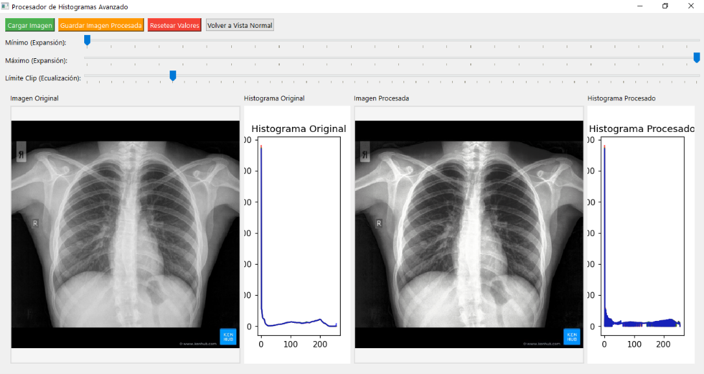
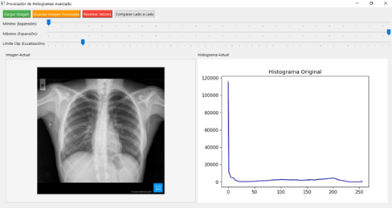

# 🖼️ Image Equalizer and Expander

A Python-based tool for enhancing image contrast using histogram equalization and contrast stretching techniques.

This project is ideal for educational purposes, preprocessing tasks in computer vision, or quickly improving low-contrast images.

---

## 🚀 Features

- ✅ Histogram equalization for better global contrast
- ✅ Contrast stretching (expansion) for dynamic range improvement
- ✅ Supports grayscale and color images
- ✅ Easy to customize and extend
- ✅ Preview before and after results

---

## 🧰 Tech Stack

- Python 3
- QT
- NumPy
- Matplotlib (optional, for visualization)

---

## 📸 Examples

### Original vs Equalized

*Original image*

*After histogram equalization and contrast expansion*
